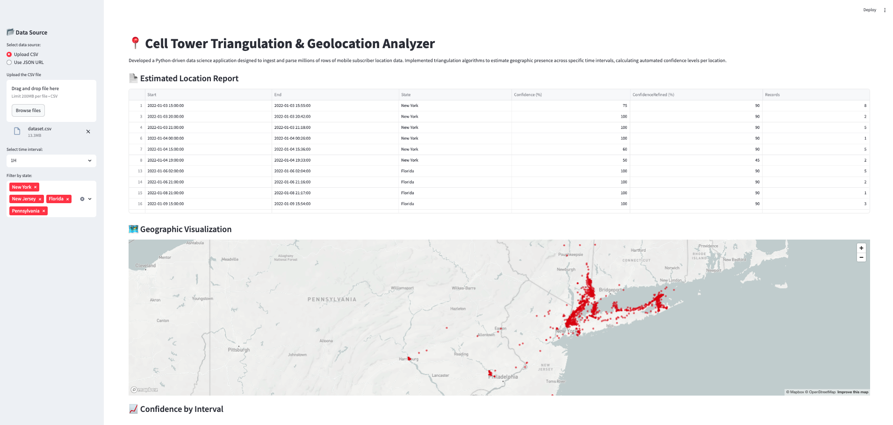
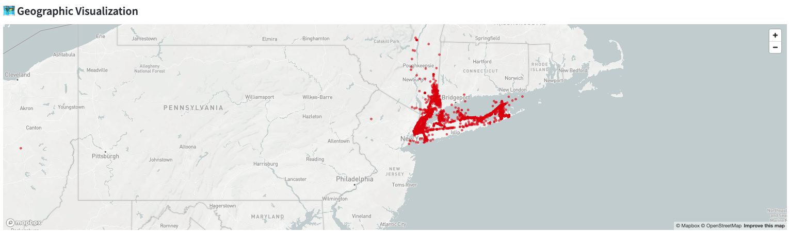
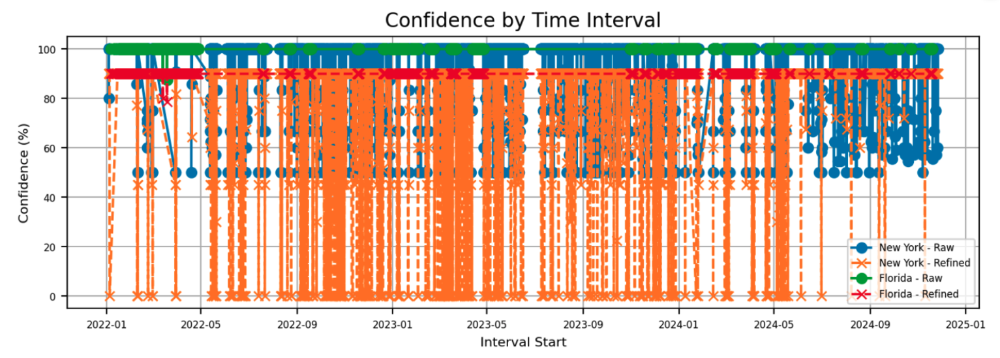
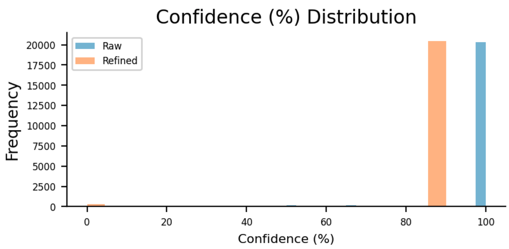
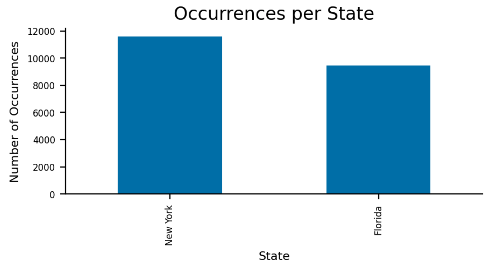

# 📍 Cell Tower Triangulation & Geolocation Analyzer

This is a Python-driven data science application designed to ingest and parse millions of rows of mobile subscriber location data with [Streamlit](https://streamlit.io/) to analyze and visualize tower triangulation. Implemented triangulation algorithms to estimate geographic presence across specific time intervals, calculating automated confidence levels per location.

<p align="center">
  
</p>

## 🔧 Features

- Upload a CSV file containing geolocation data or API URL json format
- Generate time-interval-based reports estimating the most likely state
- Display confidence percentages for each estimate
- Interactive map visualization
- Filter report by selected states
- Export results to CSV
- Download charts (line, histogram, bar) as PNG images

## 📊 Sample Visuals

- Interactive maps with estimated positions
  <br>
  

- Time-based line charts of confidence levels
  <br>
  

- Histograms of confidence distribution
  <br>
  

- State frequency bar charts
  <br>
  

## 🧪 Project Structure

```
├── app.py               # Main application
├── requirements.txt     # Python dependencies
├── .gitignore           # Git ignored files
├── dataset.csv          # CSV Dataset
├── dataset.json         # JSON Dataset for external API test
└── README.md            # Documentation
```

## 📝 License
- This project is licensed under the MIT License.

## 📦 Dependencies

- Python (3.13)
- Streamlit (>=1.32.0)
- pandas (>=2.2.0)
- matplotlib (>=3.8.0)
- altair (>=5.1.0)

## 📁 Input File Format

The uploaded CSV file should contain at least the following columns:

- `UTCDateTime` (timestamp in UTC)
- `Latitude`
- `Longitude`
- `State`

If you want to use API URL instead of csv upload, copy and past the URL bellow to simulate an API:
https://raw.githubusercontent.com/saulostopa/location-estimation-app/refs/heads/main/dataset.json

Example rows:

```csv
UTCDateTime,Latitude,Longitude,State
2021-01-05T10:15:00Z,41.123,-73.456,NY
2021-01-05T10:30:00Z,41.124,-73.457,CT
```


## 🚀 Getting Started

#### 1. Clone the Repository

```
git clone https://github.com/saulostopa/location-estimation-app.git
cd location-estimation-app
```

#### 2. Install Requirements

We recommend using a virtual environment:

```
python3.13 -m venv venv
```

```
source venv/bin/activate
```

On Windows:

```
venv\\Scripts\\activate
```

Install requirements

```
pip install -r requirements.txt
```

#### 3. Run the App

```
streamlit run app.py
```

#### 4. Open in Browser
- Streamlit will automatically open the application in your default browser at http://localhost:8501


#### 5. Deploy on Streamlit Cloud

- Go to https://streamlit.io/cloud
- Log in with your GitHub account
- Click “New app”
- Select the repository and the main branch
- Set app.py as the main file
- Click “Deploy”


### 6. ToDo

- Periodically extract data from a PostgreSQL database.
- Transform and save the data in Redis (as JSON, lists, hashes or strings).
- Redis will serve as a temporary read source, accessible via URL or public API.
